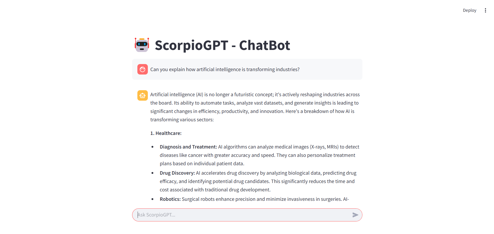

# ScorpioGPT - A Chatbot powered by Google Gemini AI

**ScorpioGPT** is an interactive AI-powered chatbot built using Streamlit and Google Gemini-Pro's generative AI capabilities. The chatbot leverages Google's cutting-edge Gemini-2.0 model to provide intelligent, human-like responses based on user input.

**Features:**

Streamlit Interface: A user-friendly, web-based interface built with Streamlit to facilitate seamless interactions with the chatbot.

Google Gemini Integration: Powered by Google Gemini's generative AI, ScorpioGPT provides contextually aware responses, creating a smooth conversation experience.

Environment Configuration: The app loads environment variables securely through `.env` files using the `dotenv` package to manage sensitive data like API keys.

Real-Time Chat: A live chat session is maintained between the user and the chatbot, with the ability to send and receive messages in real time.

**How it Works:**

The app uses Streamlit to create the web interface where users can chat with the bot.

When the user inputs a message, it's sent to the Google Gemini-Pro API via `google.generativeai`.

The response is processed and displayed in the Streamlit interface for easy interaction.

The chat history is stored in the session state to ensure a seamless conversation flow.

**Requirements:**

Python 3.x

Streamlit

`google.generativeai` library

`python-dotenv` for secure environment variable management


## Installation

1. Clone the repository:

```bash
  git clone https://github.com/gauravsinghoffl/scorpio-gpt-streamlit-chatbot.git

```

2. Install dependencies:

```bash
  pip install -r requirements.txt

```
3. Create a .env file in the root directory and add your GOOGLE_API_KEY:

```bash
  GOOGLE_API_KEY=your_google_api_key_here

```
4. Run the app:
```bash
  streamlit run app.py

```
## License

[](https://choosealicense.com/licenses/mit/)


## Environment Variables

To run this project, you will need to add the following environment variables to your .env file.

`GEMINI_API_KEY`


## Demo



## Author

- [@gauravsinghoffl](https://www.github.com/gauravsinghoffl)


## Contributing

Feel free to fork the repository, create a branch, and submit a pull request. Contributions are always welcome!

## Feedback

If you have any feedback, please reach out to us at 2116181@saec.ac.in
